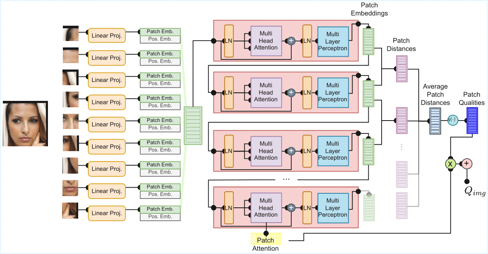
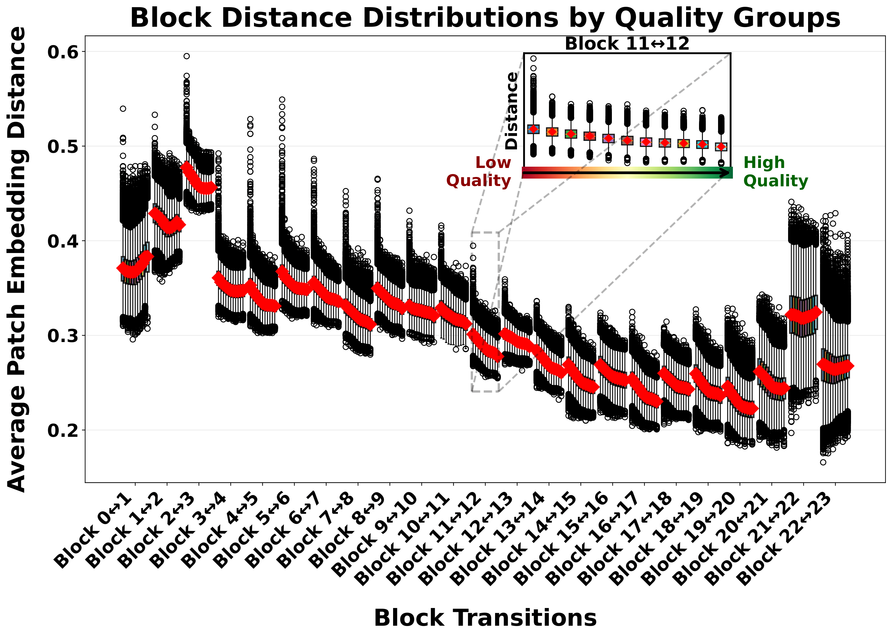
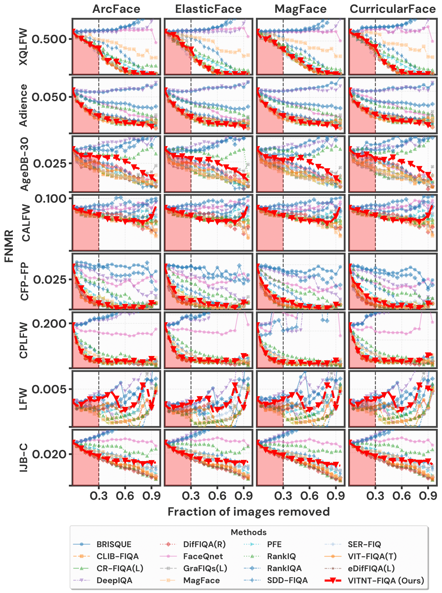

# ViTNT-FIQA: Training-Free Face Image Quality Assessment with Vision Transformers

This repository contains the official implementation of the paper **"[ViTNT-FIQA: Training-Free Face Image Quality Assessment with Vision Transformers](https://arxiv.org/pdf/2601.05741)"**, accepted at WACV2026 Workshops.

## Overview

**ViTNT-FIQA** is a training-free Face Image Quality Assessment (FIQA) method that measures the stability of patch embedding evolution across intermediate Vision Transformer (ViT) blocks. Unlike existing approaches that require multiple forward passes, backpropagation, or additional training, our method achieves competitive performance with just a single forward pass through pre-trained ViT-based face recognition models.

### Key Features

- **Training-Free**: No additional training or fine-tuning required
- **Single Forward Pass**: No backpropagation or multiple forward passes needed
- **Immediate Applicability**: Works with any pre-trained ViT-based face recognition model
- **Competitive Performance**: Achieves competitive results on 8 benchmark datasets with the state-of-the-art
- **Efficient**: Minimal computational overhead compared to existing training-free methods

### Method Overview

<p align="center">
  
</p>

Our method analyzes the stability of patch representations across transformer blocks based on the hypothesis that **high-quality face images exhibit stable feature refinement trajectories**, while degraded images show erratic transformations. The quality assessment pipeline consists of four steps:

1. **Patchification & Embedding**: Face image is divided into patches and linearly projected to embeddings
2. **Intermediate Extraction**: Patch representations are extracted from selected transformer blocks
3. **Cross-Block Distance**: L2-normalized embeddings are compared across consecutive blocks
4. **Score Aggregation**: Patch-level distances are aggregated (uniformly or using attention weights) to produce image-level quality scores

### Empirical Validation

<p align="center">
  
</p>

We validate our hypothesis on **[SynFIQA](https://github.com/oufuzhao/MR-FIQA)** dataset (5.5M images with controlled degradation levels). The figure shows boxplots of mean L2 distances between consecutive ViT-B patch embeddings across 11 quality groups. The systematic decrease in cross-block distances with increasing ground-truth quality confirms that patch embedding stability serves as a quality indicator.

### Pretrained Model

Download the pretrained ViT-Base face recognition model from [CVL-Face](https://huggingface.co/minchul/cvlface_adaface_vit_base_webface4m) and place it in the `pretrained/` directory:

## Usage

Run the evaluation script `evaluation/run.sh`.

## Experimental Results

### State-of-the-Art Comparison

<p align="center">
  
</p>

Error-versus-Discard Characteristic (EDC) curves at FMR=1e-3 across 8 benchmark datasets (LFW, AgeDB-30, CFP-FP, CALFW, Adience, CPLFW, XQLFW, IJB-C) using 4 FR models (ArcFace, ElasticFace, MagFace, CurricularFace). Our method (**red line**) consistently tracks state-of-the-art approaches.

### Computational Comparison

| Method | Training | Feed-Forwards | Backwards |
|--------|----------|---------------|-----------|
| [SER-FIQ](https://github.com/pterhoer/FaceImageQuality) | ✗ | 100 | 0 |
| [GraFIQs](https://github.com/jankolf/GraFIQs) | ✗ | 1 | 1 |
| **ViTNT-FIQA** | ✗ | 1 | 0 |

## Citation
```
@misc{ozgur2026vitntfiqatrainingfreefaceimage,
      title={ViTNT-FIQA: Training-Free Face Image Quality Assessment with Vision Transformers}, 
      author={Guray Ozgur and Eduarda Caldeira and Tahar Chettaoui and Jan Niklas Kolf and Marco Huber and Naser Damer and Fadi Boutros},
      year={2026},
      eprint={2601.05741},
      archivePrefix={arXiv},
      primaryClass={cs.CV},
      url={https://arxiv.org/abs/2601.05741}, 
}
```

## License
>This project is licensed under the terms of the **Attribution-NonCommercial-ShareAlike 4.0 International (CC BY-NC-SA 4.0)** license.  
Copyright (c) 2026 Fraunhofer Institute for Computer Graphics Research IGD Darmstadt  
For more details, please take a look at the [LICENSE](./LICENSE) file.
